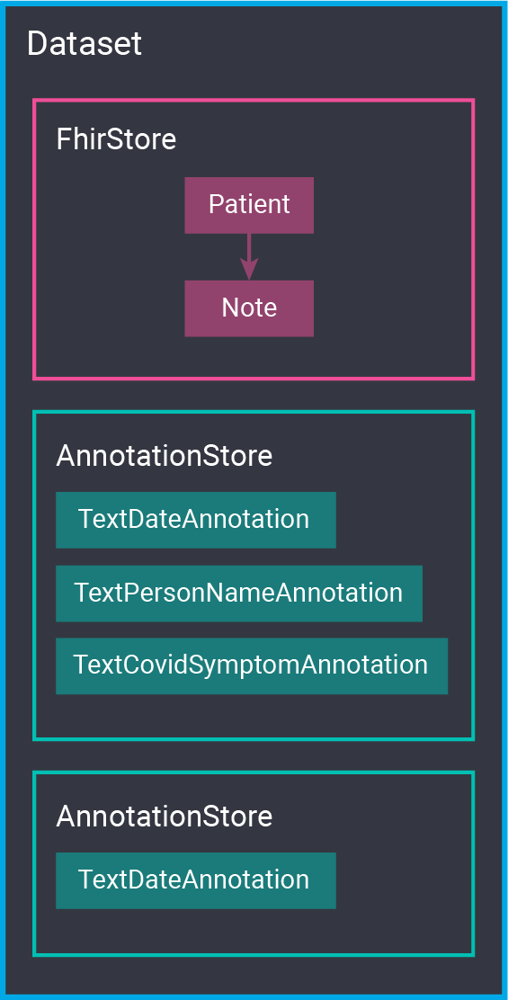

# NLP Sandbox Data Node

Repository of FHIR and annotation resources used to benchmark NLP Sandbox tools

## Overview

This repository provides a Python-Flask implementation of the [NLP Sandbox Data
Node]. This Data Node relies on a MongoDB instance to store FHIR and annotation
resources used to benchmark NLP Sandbox tools.

This Data Node can be used to:

- Create and manage datasets
- Create and manage FHIR stores
  - Store and retrieve FHIR patient profiles
  - Store and retrieve clinical notes
- Create and manage annotation stores
  - Store and retrieve text annotations

The figure below illustrates the organization of the data. A Dataset can have
one or more FhirStores and AnnotationStores. An AnnotationStore can include
different types of annotations. In NLPSandbox.io, the gold standard of a dataset
is stored in one AnnotationStore. We then use N AnnotationStores to store the
predictions generated by N tools contributed to NLPSandbox.io.

### Specification

- Data Node API version: 1.2.0
- Data Node version: 1.2.1
- Docker image: [nlpsandbox/data-node]

## Usage

### Running with Docker

Create the configuration file.

    cp .env.example .env

The command below starts the Data Node locally.

    docker compose up

You can stop the container run with `Ctrl+C`, followed by `docker compose down`.

> Note: `docker compose` is not yet available on Linux. Use `docker-compose`
> instead.

### Running with Python

We recommend using a Conda environment to install and run the Data Node.

    conda create --name data-node python=3.9.4
    conda activate data-node

Create the configuration file and export its parameters to environment
variables.

    cp .env.example .env
    export $(grep -v '^#' .env | xargs -d '\n')

Start the MongoDB instance.

    docker compose up -d db

Install and start the Data Node.

    cd server/
    pip install -r requirements.txt
    cd server && python -m openapi_server

### Acessing the UI

The Data Node provides a web interface that you can use to create and manage
resources. The address of this interface depends on whether you run the Data
Node using Docker (production mode) or the Python development server.

- Default: HTTP://localhost:8080/ui
- Format: `http://localhost:{SERVER_PORT}/ui`

## Contributing

Thinking about contributing to this project? Get started by reading our
[Contributor Guide](CONTRIBUTING.md).

## License

[Apache License 2.0]

<!-- Links -->

[nlpsandbox.io]: https://www.synapse.org/nlpsandbox
[NLP Sandbox]: https://www.synapse.org/nlpsandbox
[NLP Sandbox Data Node]: https://nlpsandbox.github.io/nlpsandbox-schemas/data-node/latest/docs/
[nlpsandbox/data-node]: https://hub.docker.com/r/nlpsandbox/data-node
[Apache License 2.0]: https://github.com/nlpsandbox/data-node/blob/develop/LICENSE
